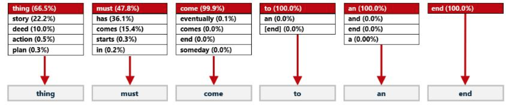
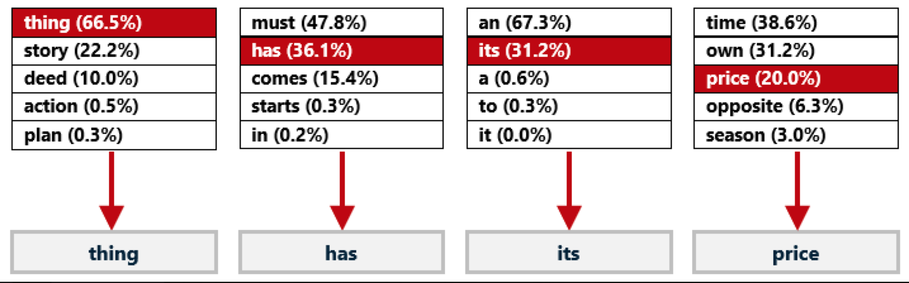

# Tokenización
Es importante señalar que los transformers no trabajan con palabras individuales (no pueden leer como los humanos). En su lugar, el texto de entrada se divide en tokens individuales, incluyendo palabras, signos de puntuación y tokens especiales. Los tokens en ChatGPT son trozos de texto representados como vectores (números con dirección y posición).

La proximidad de los vectores de tokens en el espacio determina su nivel de asociación: cuanto más cerca están, más relacionados están. Además, la atención se codifica como un vector, lo que permite a las redes neuronales basadas en transformadores retener información crucial de las partes precedentes de un párrafo.

Cuando un usuario interactúa con ChatGPT, el modelo recibe como entrada el historial de la conversación, incluidas tanto las preguntas del usuario como las respuestas generadas por el modelo. La entrada se convierte en token y se introduce en la red neuronal. Cada token se asocia a una incrustación que representa su significado en el contexto de la conversación.

GPT-3 se ha entrenado con unos 500.000 millones de tokens, lo que permite a sus modelos lingüísticos asignar significados con mayor facilidad y predecir textos de seguimiento plausibles mediante su mapeo en el espacio vectorial. Muchas palabras corresponden a un único token, aunque las palabras más largas o complejas suelen dividirse en varios tokens. Por término medio, los tokens tienen una longitud aproximada de cuatro caracteres.

## Fase de Inferencia
Durante la fase de inferencia, en la que el modelo genera respuestas, se utiliza un proceso conocido como autoregresión. Esto significa que el modelo predice una palabra cada vez, condicionado por el historial de la conversación y las palabras generadas anteriormente. Para garantizar que la respuesta generada sea coherente y pertinente, se utilizan técnicas como el muestreo top-p y el escalado de temperatura.

En resumen, el parámetro top-p proporciona al modelo un conjunto de opciones (tokens) entre las que elegir, mientras que la temperatura determina la probabilidad de elegir un determinado token. Cuando la temperatura se fija en 0, el modelo elegirá sólo los tokens más "populares" (palabras que se encuentran juntas con más frecuencia en los datos de texto con los que se entrenó ChatGPT):

Esto no siempre es bueno. Las temperaturas más altas hacen que los resultados sean más diversos:

